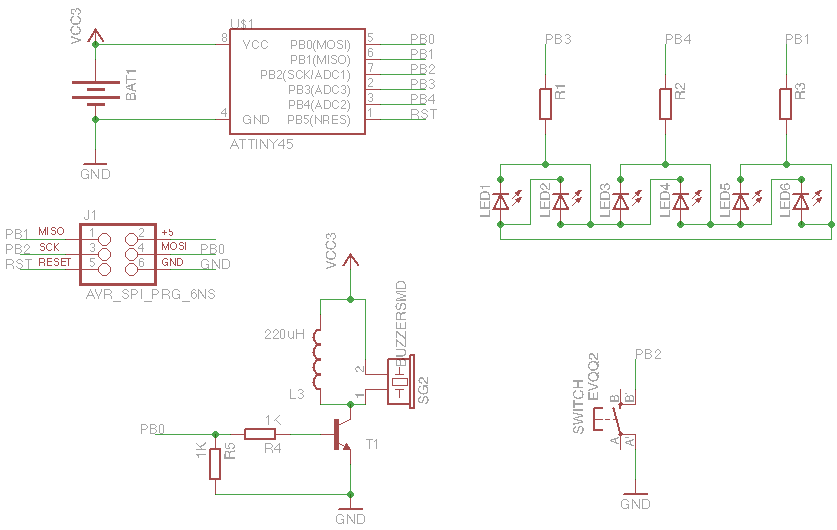
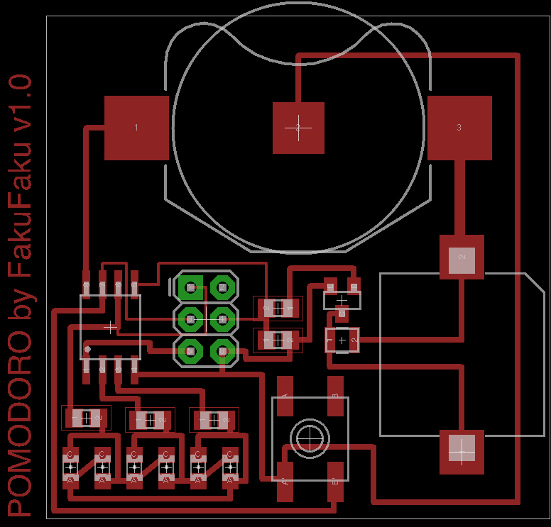
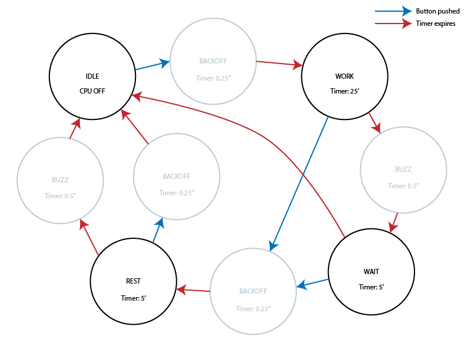

Pomodoro
========

A custom built timer for the [pomodoro technique](http://pomodorotechnique.com/).

Use it
------

1. One click starts a 25 minutes _work_ counter. Five yellow LED indicates how
  many slices of five minutes are left. There is a discrete beep when the timer
  expires. The LED then flashes to remind you to go into _rest_ mode.
2. A second click starts a 5 minutes _rest_ counter. A **red** LED is turned on.
  There is a discrete beep when it expires. Then the timer turns off.
3. If you wish the turn the timer off during _rest_ mode, click a third time the button.

Build it
--------

### Bill Of Material

* 1x ATtiny85
* 5x LED yellow, SMD 0805
* 1x LED red, SMD 0805
* 3x 22 Ohm Resistor, SMD 0805
* 2x 1K Ohm Resistor, SMD 0805
* 1x PNP BPJ transistor, SOT-23 (BC846CMTF)
* 1x 1mH Inductor, SMD 1007
* 1x Buzzer, SMD [mouser](http://www.mouser.com/ProductDetail/Kobitone/254-PB501-ROX/?qs=%2fha2pyFaduio21Wb3%2fEgDw7Itv2u2RCUk%252bCSGDldQmgXvX6wRiKaqw%3d%3d)
* 1x CR2032 coin cell holder, SMD [mouser](http://www.mouser.com/ProductDetail/Linx-Technologies/BAT-HLD-001/?qs=sGAEpiMZZMupuRtfu7GC%252bdEIlVvqTbq%252bJLMEoC1V420%3d)
* 1x Tactile switch, SMD EVQ-Q2 [mouser](http://www.mouser.com/ProductDetail/Panasonic/EVQ-Q2K03W/?qs=sGAEpiMZZMsgGjVA3toVBA4puZS2llK5hCEf4xZ%2f9rI%3d)

### Schematic

### Etch the PCB

The PCB can be etched using the [mask](Pomodoro_mask.eps) provided in EPS format.
Here is a picture of the layout.

### Firmware

The firmware is in the `firmware` folder. It can be uploaded using avrdude and
a [usbtiny-isp](https://www.sparkfun.com/products/9825), for example. The idea is
to press a six-pin header againt the PCB directly when programing. Some spring-loaded
pins would be ideal for the job. The square pad is pad number one of a six-pin ISP
header.

To compile and upload (assuming you have avr-gcc and avrdude installed), type the
following in a terminal.

    make avrdude

The Code
--------

My goal was to use explore the possibilities of the ATtiny85 microcontroller. We use it here
as a timer that first counts 25 minutes (work time) and emit a signal. Then, we can start a second
counter for 5 minutes (rest time). Here is what we use.

* A tactile switch connected to the _INT0_ of the avr as the sole user input. We use it
  to turn the counter off and switch between different modes.
* A buzzer to give a discrete signal when the timer expires. The buzzer is driven
    by _TIMER0_ in PWM mode at 4 kHz, 50% duty cycle.
* As many LEDs as possible to indicate the progress of the timer. By default,
    the ATtiny85 has 5 GPIO pins (we could add an extra one, but would lose ISP).
    We have thus 3 GPIO remaining.   
    We assign all of them to LEDs and using
    [charlieplexing](https://en.wikipedia.org/wiki/Charlieplexing), it is
    possible to drive 6 LEDs using only 3 pins. We choose 5 yellow, for every 5
    minutes slice of the first timer, and a single red one, for the _rest time_
    of the second timer.

The code is completely interrupt driven. _TIMER1_ and its overflow interrupt
are used to keep track of time during each state. The tactile switch triggers
an interrupt to wake up the avr, or switch between states. The [finite state
machine](https://en.wikipedia.org/wiki/Finite-state_machine) looks like this.
Blue arrows are state switching triggered by a push on the button. Red arrows
are switching caused by the timer expiration.

The _main_ states are black circles. The grey circles are the transition states.
It was important to add the `BACKOFF` state to debounce the tactile button because it triggered multiple interrupts.

License
-------

2014 (c) Robin Scheibler aka FakuFaku

    "THE BEER-WARE LICENSE" (Revision 42):
    <fakufaku@gmail.com> wrote this file. As long as you retain this notice you
    can do whatever you want with this stuff. If we meet some day, and you think
    this stuff is worth it, you can buy me a beer in return -- Robin Scheibler

